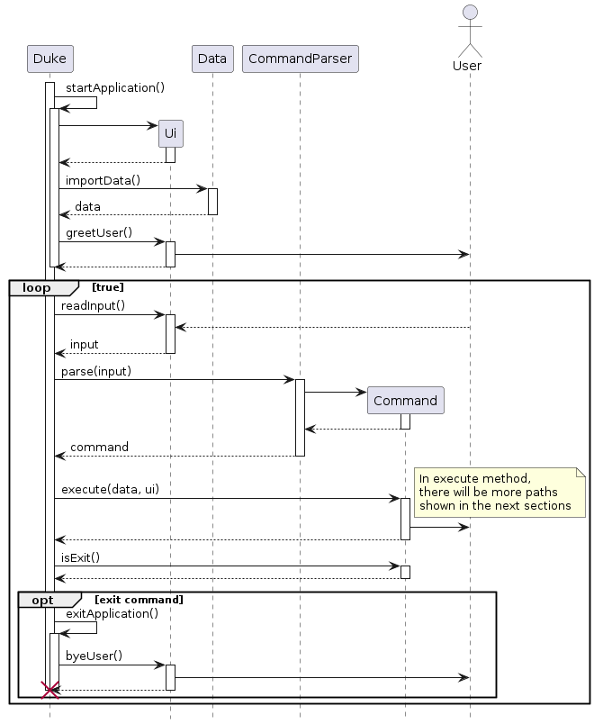
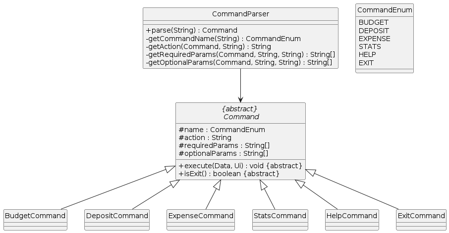
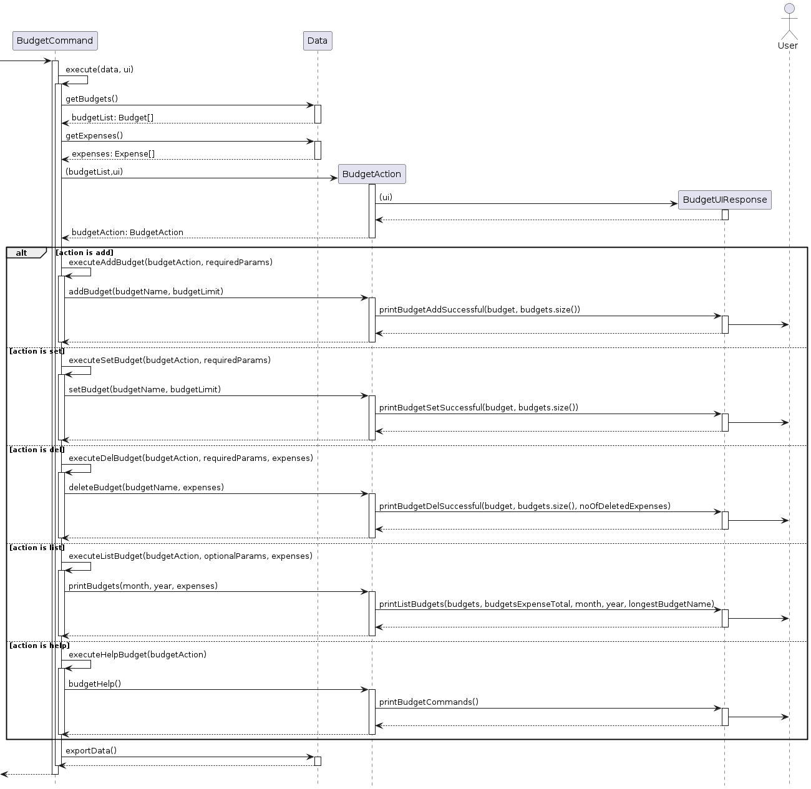

# Developer Guide

## Introduction

Budget Buddy aims to help those who want a Command Line Interface App that is a one-stop solution to keep track of their
expenses, help them with budgeting and also be help them to visualise what they have spent.

Overspending and the lack of savings is a significant problem found in most fresh graduates. We want to create tools
necessary for them so that they can realize their actual spending and achieve financial freedom in the future.

## Setting up the project

## Design

### General Overview

Below is an architectural diagram that describes the overview of how BudgetBuddy works.

When the user initialises Budget Buddy, the logic of Budget Buddy will check if there is any pre-existing stored data.
This persistence is done by using Gson read stored data into classes that will be used in
Budget Buddy. As the user interacts with the UI, the logic will change the data of Budget Buddy, which is then written
in Json format to update the storage. This process continues until the user exits Budget Buddy.

### Main Component

**This diagram only shows the main overview of the application. You can refer to other components for more information.**

In the main class, the main method first calls startApplication() which initalizes the Log Manager for logging (disabled in production stage) and Ui object for printing output messages. After initialized, it will then attempt to
import the user's data from `data.json`. If there is no file, it will initalize a blank data. If importing fails, the
application will print an error message and terminate. Once done, it will greet the user and display the budget progress (for returning users).

The application then runs an infinite loop to take in and execute commands, until when the inputs `exit` to exit the
application. After which, it will output a bye message and exits the application safely.

### Command Component

The command consists of three components: Enum CommandEnum, Abstract class Command and Class CommandParser. Each of them
plays a role in retrieving the commands input by the user and redirecting to the correct components.

For every command that the user wants to execute, the input of the command must be in this format as follows:
> `(command) (action) (parameters) [optional parameters]`

An example of a command can be seen in the user guide.

For each parameter, the type of value must either be: `integer`, `double`, `date`, or `string`, depending on the parameter's specification.
- integer: Input must be a valid integer.
- double: Input must be a valid double that is positive, must not contain alphabet and at most 2 decimal places.
- date: Input must be a valid date in the format `DD-MM-YYYY`, and year must be in 4 digits.
- string: Input can be in any alphanumeric but at most 30 characters.

Note that the value must not contain any slash (`/`), as it interferes with the parameter format.

#### CommandEnum

The Enum class CommandEnum contains all the commands that are available in the application, as shown in the diagram in Command Component. These are the commands that can only be input in the command line.

#### Command

The abstract class Command extends to several command classes (e.g. `BudgetCommand`, `DepositCommand`, `ExpenseCommand`) and contains abstract (execute() and isExit()) and normal methods.

Each child (extended) class has a list of actions for its command and the list of required & optional parameters for each action. These list of actions and parameters are to be used in the CommandParser class, where it validates the input given by the user. For commands such as Help and Exit, no actions and parameters are required.

In the execute() method, the method is executed from main, where it will go to the action class (eg `BudgetAction`) and run the requested action such as `add` along with the required & optional parameters.
After execute() is done, isExit() controls the termination of the application by returning a boolean.

**There are some variables and methods that are not shown in the class diagram for easier readability.**

#### CommandParser

The `CommandParser` class is responsible for validating the input given by the user, which in return will pass a Command object (containing the user's requested action) that can be executed.

The parse() function first checks the command name, which will return the list of actions that are available if the command is valid. Then, it will retrieve the action name and see if it matches in the list of actions.

**(Note that commands such as Help and Exit do not have any action, which the command will be returned immediately.)**

After verifying that the action exists, it will then verify all the parameters that are needed to execute.

In required parameters, each parameter must have a value. Whereas for optional parameters, the user can choose to input values for none, some, or all of the optional parameters. When the value of the parameter does not match the parameter type, it will stop the parsing process and return an exception.

**Command and action names are not case sensitive, but values are.**

**Also, it is possible to rearrange the order of parameters.**

## Product scope

### Item Component

The main 4 classes of BudgetBuddy are the `budget` , `deposit`, `expense` and `stats` class. Users are able to add, store and visualise the date relate to each of these classes. Each of these classes are modelled as an `Item`.

### Budget Component

#### BudgetCommand Class

The `BudgetCommand` class contains methods that are related to the `Budget` function. Users are able to create
new budgets, which are stored in a budget list. The category word from the user's input is taken from the first word of
the users input,
and the second word of the users input is the action word. The first word is processed through the `CommandParser`
class. If the
Command word is "budget", it will be processed into the `BudgetCommand` class. The action word is then processed into
the `BudgetAction` class.
The class diagram below shows how the `BudgetCommand` parent class is implemented, as well as its extended classes.

#### BudgetCommand Sequence

Once a string `input` from the user has been deemed as a `Budget` command as explained in the `CommandParser` sequence
diagram above,
the `input` will be passed into the `BudgetCommand` class. This class determines what budget commands to carry out to
update the `data` stored in the `Budget` and `Expense` array lists, as shown in the sequence diagram below.

### Deposit Component

### DepositCommand Class

The `DepositCommand` class contains methods that relate to the execution of the deposit functionality in BudgetBuddy.
Users can
create new deposits with a timestamp (if necessary). These deposits are stored in a deposit list and users can delete
deposits, find
deposits using keywords, and list all deposits.

The user's input is split by the parser in the `CommandParser` class and is redirected to the 'DepositCommand' class if
the first word
is "deposit." Based on the second word, a method in `DepositAction` class is called corresponding to the command
requested by the user.

Attached below is how the `DepositCommand` class is implemented along with its relation with the other `Data` classes
and the abstract
`Command` class.

### Design & Implementation of the Deposit Feature

Like all other functionalities of BudgetBuddy, the deposit feature is heavily modularized and designed with an OOP lens.
Because of this,
the parsing of user input, the parsers for each feature, and each feature's actions are all in separate classes.

On a high level, the deposit feature starts with `CommandParser` taking in the input and choosing which `Command` class
to execute from.
This happens with all user input in BudgetBuddy. Then if the first word is "deposit," the `execute` function of
the `DepositCommand` class
will run, creating a new `DepositAction` class. The `execute` function will run a method corresponding to what the user
inputs. The design
of this three class system is meant to modularize the different aspects of the internal logic so future problems would
be encapsulated in a specific location.

### Expense Component

### ExpenseCommand Class

The `ExpenseCommand` class contains methods that relate to the execution of the expense functionality in BudgetBuddy.
Users can
create new expense entries with a timestamp (if necessary). These expenses are then stored in an expense list and users
can delete existing
expenses, find expenses using keywords, and list all expenses according to their categories.

The user input is split by the parser in the `CommandParser` class and is redirected to the `ExpenseCommand` class if
the first word is
"expense". Based on the second command word, a method in `CommandAction` class is called corresponding to the command
entered by the user.

Attached below is how the `ExpenseCommand` class is implemented along with its relation with the other `Data` classes
and the abstract
`Command` class.

### ExpenseCommand Sequence

Once a string `input` from the user has been deemed as an `Expense` command, the `input` will be passed into the
`ExpenseCommand` class. This class determines what expense commands to carry out to update the `data` stored in the
`Budget` and `Expense` array lists, as shown in the sequence diagram below.

### Design & Implementation of the Expense Feature

The expense feature is similarly modularized and designed with an OOP lens. As such, its functionalities have been
separated into different
classes such as the parsing of user input, and the parsing and execution of each of its features.

On a high level, the expense feature starts with `CommandParser` taking in the input and choosing which `Command` class
to execute from.
This happens with all user input in BudgetBuddy. Then, if the first word is "expense", the `execute` function of
the `ExpenseCommand` class
will run, creating a new `ExpenseAction` class. The `execute` function will run a method corresponding to what the user
inputs. The design
of this three class system is meant to modularize the different aspects of the internal logic so future problems would
be encapsulated in
a specific location.

### Stats Component

### StatsCommand Class

The 'StatsCommand' class contains methods that are related to the execution of the stats functionality in BudgetBuddy.
Users can
use this command to view all the details of their expenses, budgets and deposits in the current month. Through this
feature, users will know
their current progress and if their expenses have exceeded their budget.

### Design & Implementation of the Stats Feature

The stats feature, just like all other features, also is designed and implemented to incorporate good OOP. Therefore,
there are
separate classes for each part of the Stats Feature, which includes StatsAction, StatsUIResponse and StatsCommand.

### Others

#### Exception Component

For invalid commands and application errors (such as file), BudgetBuddy will display an error message which requires the user to rectify his/her input or do something, including restarting the application. 

#### File IO Component

The input and output of a file is handled using Gson, a third-party plugin that can help to read/write .json file in the Json format. The data file `data.json` (default) is created under the directory that the user is running at after an action is executed in the application. If the application finds the file to be blank, or the format of json is corrupted, it prompts the user to manually delete the file before starting the application.

**Therefore, It is not recommended for users to edit the file manually.**

## Appendix A: User Stories

| Version | As a ...       | I want to ...                                                                   | So that I can ...                                                            |
|---------|----------------|---------------------------------------------------------------------------------|------------------------------------------------------------------------------|
| v1.0    | quick user     | enter my inputs immediately rather than clicking and typing                     | have a convenient way of managing my budget                                  |
| v1.0    | new user       | know how to setup my application                                                | use the application and insert my financial data                             |
| v1.0    | forgetful user | get all the commands I can input                                                | know what are the commands available                                         |
| v1.0    | forgetful user | know the syntax for each action                                                 | know how to perform an action                                                |
| v1.0    | careless user  | receive an error message when entering a wrong command                          | rectify my errors in the next input                                          |
| v1.0    | user           | add my monthly budget for a category (eg. transportation, utilities, food etc.) | have an organised view of my overall budget                                  |
| v1.0    | user           | list down my budget for each category                                           | tell if my salary/earnings is sufficient for the total amount of all budgets |
| v1.0    | user           | modify my budget for a category                                                 | allocate more/less budget to a category                                      |
| v1.0    | user           | delete a budget category                                                        | remove a budget category that I wrote the category name wrongly              |
| v1.0    | user           | add in additional deposit from bank interest/investments                        | increase my savings                                                          |
| v1.0    | user           | remove my additional deposits that I added                                      | delete wrong inputs                                                          |
| v1.0    | user           | list down all my additional deposits                                            | tell how much additional deposits I have made in total                       |
| v1.0    | user           | add an expense for an item I have spent on                                      | keep track of what I have spent on and how much I have spent                 |
| v1.0    | user           | set an expense to a category                                                    | organise my expense history and deduct from the selected category            |
| v1.0    | user           | delete an expense                                                               | delete wrong inputs                                                          |
| v1.0    | user           | view my expense history                                                         | see how much I have spent overall                                            |
| v1.0    | user           | view the overall statistics                                                     | know what is my progress on spending and saving for the month                |
| v1.0    | user           | load my deposit, budget and expense data                                        | retain all my information when I launch the application again                | 
| v1.0    | user           | save my deposit, budget and expense data                                        | retain all my information when I launch the application again                |
| v1.0    | leaving user   | know if I exited the application safely                                         | ensure that there are no errors in the application                           |
| v2.0    | careless user  | get all the actions of a command I can input                                    | know what actions are available                                              |
| v2.0    | user           | show the current progress of my budget                                          | check if I have overspent a category                                         |
| v2.0    | user           | show my budget results for a certain month/year                                 | check my past budget results                                                 |
| v2.0    | user           | find deposit(s) based on name                                                   | recall how much I made from a deposit                                        |
| v2.0    | user           | list down my deposits and/or expenses at a date range                           | check my past deposits/expenses that I've added                              |
| v2.0    | user           | list down my expenses based on category                                         | know what I've spent for a specific category                                 | 
| v2.0    | user           | clear deposits and/or expenses at a date range (or all)                         | delete quickly without doing one by one                                      |
| v2.0    | user           | clear expenses based on category                                                | delete quickly without doing one by one                                      |
| v2.0    | user           | display more stats information such as deposits and expenses                    | have a brief overview of a month’s spending                                  |
| v2.0    | user           | view the overall statistics for a certain month/year                            | check my past results                                                        |
| v2.0    | returning user | be reminded of my budget progress when I launch the app                         | realise my progress and minimise my spending                                 |

## Appendix B: Non-Functional Requirements

1. Works on any common operating systems (Windows, Mac OS, Linux) with Java 11 or above installed.
2. A user with average typing speed should take up to 7 seconds for the longest command (expense add).
3. Data of the application is still preserved when migrating from one computer to another.

## Appendix C: Glossary

* *Budget* - A category of a budget (e.g. Transport, Food, Electricity) with the maximum spending budget indicated by
  the user.
* *Deposit* - Additional earnings (e.g. Lottery, Bank interest) that is made by the user
* *Expense* - An item that the user has spent on, which must be related to a Budget.
* *Stats* - Statistics of savings and expenditure

## Appendix D: Instructions for manual testing

{Give instructions on how to do a manual product testing e.g., how to load sample data to be used for testing}

## Appendix E: Acknowledgements

[Gson](https://github.com/google/gson)