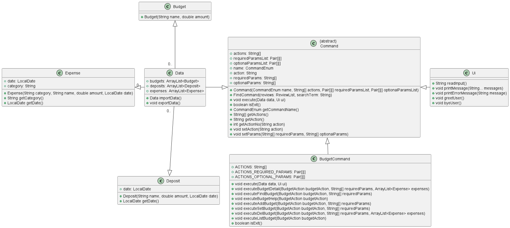

# Developer Guide

## Acknowledgements

{list here sources of all reused/adapted ideas, code, documentation, and third-party libraries -- include links to the
original source as well}

## Design & implementation

{Describe the design and implementation of the product. Use UML diagrams and short code snippets where applicable.}

### Item Classes

The main 3 classes of Duke are the `budget` , `expense` and `deposit` class. Users are able to add, store and visualise
the date relate to each
of these classes. Each of these classes are modelled as an `Item`.

### BudgetCommand Class

The `BudgetCommand` class contains methods that are related to the `Budget` function of Duke. Users are able to create
new budgets, which are stored in a budget list. The category word from the user's input is taken from the first word of
the users input,
and the second word of the users input is the action word. The first word is processed through the `CommandParser`
class. If the
Command word is "budget", it will be processed into the `BudgetCommand` class. The action word is then processed into
the `BudgetAction` class.
The class diagram below shows how the `BudgetCommand` parent class is implemented, as well as its extended classes.

## Product scope

### Target user profile

Budget Buddy aims to help those who want a Command Line Interface App that is a one-stop solution to keep track of their
expenses, help them with budgeting and also be help them to visualise what they have spent.

### Value proposition

{Describe the value proposition: what problem does it solve?}

## User Stories

|Version| As a ... | I want to ... | So that I can ...|
|--------|----------|---------------|------------------|
|v1.0|new user|see usage instructions|refer to them when I forget how to use the application|
|v2.0|user|find a to-do item by name|locate a to-do without having to go through the entire list|

## Non-Functional Requirements

{Give non-functional requirements}

## Glossary

* *glossary item* - Definition

## Instructions for manual testing

{Give instructions on how to do a manual product testing e.g., how to load sample data to be used for testing}
